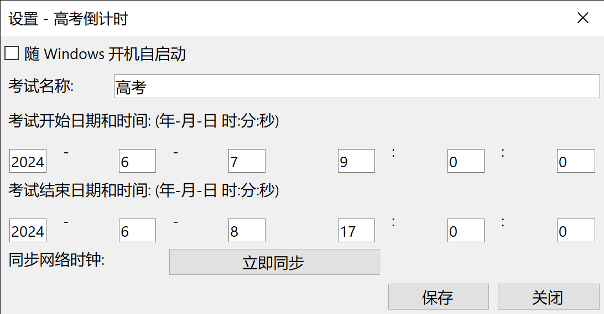
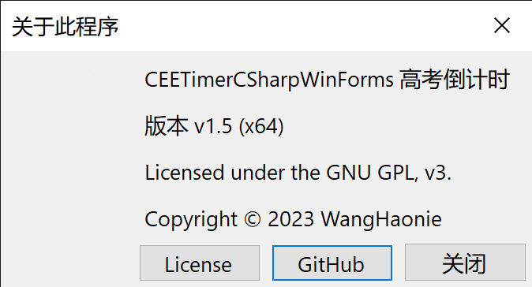
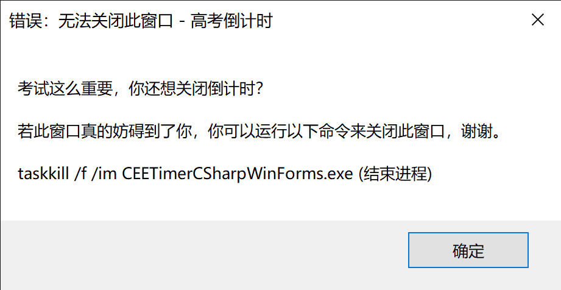

# CEETimerCSharpWinForms
   
## 简介
CEETimerCSharpWinForms，适用于 Windows 系统的高考倒计时，自 v1.6 起不再只是高考倒计时，你可以自定义考试名称。
> 开发环境：Visual Studio 2022，C#，WinForms，.NET Framework 4.7.2
## 运行截图
1. 主窗口 (可右键显示更多选项)

查看图片

当还没有到考试开始时间时

查看图片

当过了考试开始时间时

查看图片

当过了考试结束时间时

查看图片

2. 设置窗口

查看图片

3. 关于窗口

查看图片

4. 当你手贱尝试 Alt+F4 关闭时

查看图片

## 主要特征和功能
> 说明：✅ 已推出的功能、⭕ 正在开发的功能、❌ 不会被考虑的功能

+ ✅ 主窗口位于屏幕左上角，并显示到最上层 (可能会被其他后来出现的同样具有顶置属性的窗口遮挡)；
+ ✅ 防止多开，同时也防止被关闭 (但可以结束进程)；
+ ✅ 一键设置开机启动；
+ ✅ 可自定义考试名称；
+ ✅ 可自定义开始、结束日期和时间；
+ ✅ 一键同步网络时钟，确保系统时间准确无误 (因涉及到修改系统设置，使用此功能可能会弹出 UAC 对话框，请手动点击允许)；
+ ✅ 适配高分辨率以及各种缩放的屏幕；
+ ⭕ 实时监测系统分辨率/缩放更改，并自动调整程序自身的缩放以确保不会模糊 (目前为止只能重启程序才不会出现模糊)；
+ ⭕ 代码优化，目前屎山和设计缺陷太多了；
+ ⭕ 检查更新功能，但只能检查不能下载，需要跳转手动下载；
+ ❌ 更改倒计时字体；
+ ❌ 更改倒计时文字颜色、大小；
+ ❌ 更改倒计时背景颜色；
+ ❌ 时时刻刻保持顶置，防止被遮挡；
## 系统要求
1. Windows x64 系统
2. .NET Framework 4.7.2 (高版本 Windows 10/11 可能预装了 4.8 或更高版本，可以不用安装。但如果你正在使用 Windows 7/8/8.1 或者虽然是 Windows 10/11 但却无法运行，请点击[此链接](https://dotnet.microsoft.com/zh-cn/download/dotnet-framework/thank-you/net472-offline-installer)下载并安装 .NET Framework 4.7.2)
## 食用方法
1. 安装运行库，详见上方 "系统要求"
2. 到[ Releases ](https://github.com/WangHaonie/CEETimerCSharpWinForms/releases/latest)下载 CEETimerCSharpWinForms_vX.X_x64.7z
3. 解压到你喜欢的文件夹
4. 双击 CEETimerCSharpWinForms.exe 就可以运行了
5. 如果你设置过考试名称、日期、时间，程序会在自身文件夹生成一个文件 CEETimerCSharpWinFormsConfig.db 用来存放配置，请不要删除，更不要随意修改其中的数据；
> 因能力有限，设置中的 设置开机启动 以及 同步网络时钟 点击后立即生效，不需要额外点击保存，当然这些设置也不会保存到配置文件中。
## 开源许可证
CEETimerCSharpWinForms is licensed under the GNU General Public License v3.0 (GPL-3.0).
