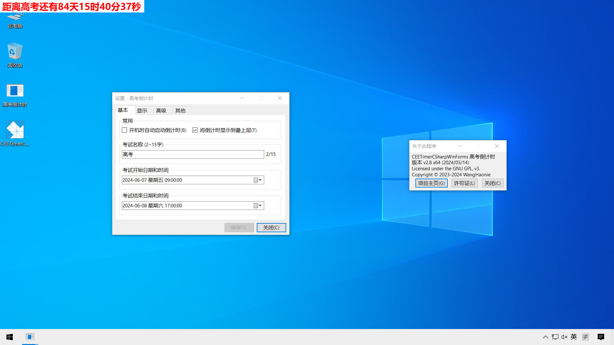

# CEETimerCSharpWinForms
   
## 简介
CEETimerCSharpWinForms，适用于 Windows 系统的高考倒计时，自 v1.6 起不再只是高考倒计时，你可以自定义考试名称。
> 开发环境：Windows 11 Pro x64 (22635.3350)，Visual Studio 2022 (17.9.3)，C# (12.0)，WinForms，.NET Framework 4.7.2
## 运行截图
> v2.8，Windows 10，1920x1080，125% 缩放

## 主要功能
> 说明：✅ 已推出的功能、❌ 不会被考虑的功能

+ ✅ 自定义考试名称；
+ ✅ 自定义考试开始、结束日期和时间；
+ ✅ 显示在屏幕左上角 (可以拖动，但不能记住位置，需手动开启)；
+ ✅ 设置是否顶置显示，默认开启 (会被其他后来出现的同样具有顶置属性的窗口遮挡)；
+ ✅ 更改倒计时字体和大小；
+ ✅ 可设置是否只显示天数等 (设置>显示)；
+ ❌ 更改倒计时文字、背景颜色；
+ ❌ 时时刻刻保持顶置，防止被遮挡。
## 其他功能
+ ✅ 防止多开，同时也防止被关闭 (但可以结束进程)；
+ ✅ 设置开机启动；
+ ✅ 内存优化 (需手动开启)；
+ ✅ 跟随虚拟桌面移动 (需手动开启，不稳定，估计是系统接口有问题)；
+ ✅ 重启倒计时 (用于更改了缩放后重启以防止窗口模糊)；
+ ✅ 检查更新功能，用户确认后可自动下载并安装；
+ ✅ 同步网络时钟，确保系统时间准确无误 (因涉及到修改系统设置，使用此功能可能会弹出 UAC 对话框，请手动点击允许)；
+ ❌ 实时监测屏幕缩放的更改并调整窗口以防止字体模糊 (可在设置里面手动点击重启)。

## 系统要求
1. 适用于 Windows 7 以上的 x64 系统；
2. 安装了 .NET Framework 4.7.2 (点此[链接](https://dotnet.microsoft.com/zh-cn/download/dotnet-framework/thank-you/net472-offline-installer)下载)。
## 食用方法
1. 安装 [.NET Framework 4.7.2](https://dotnet.microsoft.com/zh-cn/download/dotnet-framework/thank-you/net472-offline-installer) (新版 Windows 10/11 可能内置了 .NET Framework 4.8 或更高版本，可以不用安装)；
2. 到 [Releases](https://github.com/WangHaonie/CEETimerCSharpWinForms/releases/latest) 下载 CEETimerCSharpWinForms_X.X_x64_Setup.exe；
3. 按照提示安装就行；
4. 初次使用需要右键主窗口，选择 设置，然后设置考试名称、开始/结束日期和时间，点击应用；
5. 当考试未开始时，倒计时会显示红色的 "距离...还有...天...时...分...秒"； 
当考试正在进行时，会显示绿色的 "距离...结束还有...天...时...分...秒" (可设置是否显示该内容)； 
当考试结束后，会显示黑色的 "距离...已经过去了...天...时...分...秒" (可设置是否显示该内容)。 
## 开源许可证
CEETimerCSharpWinForms is licensed under the [GNU General Public License v3.0 (GPL-3.0)](https://github.com/WangHaonie/CEETimerCSharpWinForms?tab=GPL-3.0-1-ov-file#GPL-3.0-1-ov-file)
## 打赏作者💰
[传送门](https://wanghaonie.github.io/reward/)

