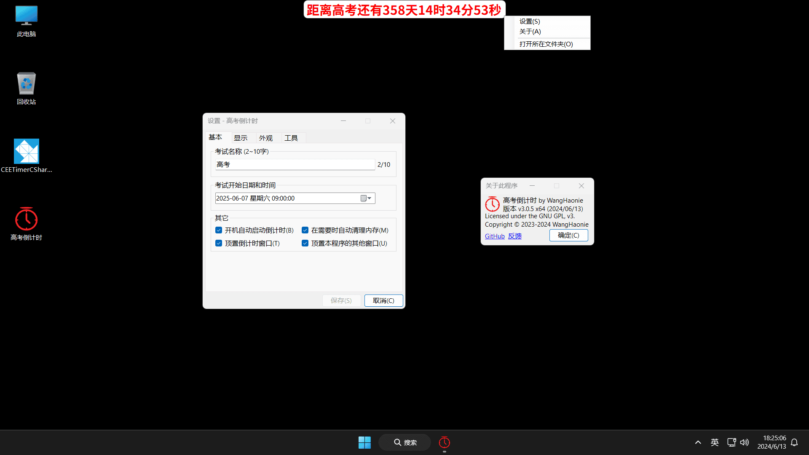

<h4>⚠️注意⚠️本程序完全免费，且仅通过此 GitHub 仓库进行发布。任何其他网站或个人提供的下载链接均未获得授权，可能存在安全风险及功能不完整。为了保障您的权益，请直接从此仓库获取软件及其最新版本。支持正版，拒绝盗版！<a href="https://github.com/WangHaonie/CEETimerCSharpWinForms/issues/new/choose" target="_blank">举报盗版</a></h4>

    
    <h2>高考倒计时 by WangHaonie</h2>

   

## 简介
CEETimerCSharpWinForms，适用于 Windows 系统的高考倒计时，支持自定义考试名称。
## 主要功能
+ ✅ 自定义考试名称；
+ ✅ 自定义考试开始、结束日期和时间；
+ ✅ 自定义显示的位置，默认左上角 (可设置)；
+ ✅ 设置是否顶置显示，默认开启 (会被其他后来出现的同样具有顶置属性的窗口遮挡)；
+ ✅ 更改倒计时字体和大小；
+ ✅ 更改倒计时文字、背景颜色；
+ ✅ 可设置是否只显示天数等 (设置>显示)；
## 其他功能
+ ✅ 可以拖动，不过需手动开启；
+ ✅ 防止多开，同时也防止被关闭 (但可以结束进程)；
+ ✅ 设置开机启动；
+ ✅ 自身内存优化 (需手动开启)；
+ ~~⛔ 跟随虚拟桌面移动 (需手动开启，不稳定，估计是系统接口有问题)；~~ (已移除, [说明](#如何显示在所有虚拟桌面上))
+ ✅ 重启倒计时 (用于更改了缩放后重启以防止窗口模糊)；
+ ✅ 检查更新功能，用户确认后可自动下载并安装；
+ ✅ 同步网络时钟，确保系统时间准确无误 (因涉及到修改系统设置，使用此功能可能会弹出 UAC 对话框，请手动点击允许)；
## 运行截图
> v3.0.4，Windows 11，1920x1080，125% 缩放

## 食用方法
### 下载安装
+ 仅适用于 Windows 7 及以上的 x64 系统；
+ 先安装 [.NET Framework 4.7.2](https://dotnet.microsoft.com/zh-cn/download/dotnet-framework/thank-you/net472-offline-installer) (新版 Windows 10/11 可能内置了 .NET Framework 4.8 或更高版本，可以不用安装)
+ 到 [Releases](https://github.com/WangHaonie/CEETimerCSharpWinForms/releases/latest) 下载安装程序 CEETimerCSharpWinForms_X.X_x64_Setup.exe，按照提示安装就行；
+ 右键倒计时会出现右键菜单 (具体设置项说明请看[这里](#设置界面介绍))。
### 如何显示在所有虚拟桌面上
+ 本程序在 v3.0.1 移除了虚拟桌面功能 (Windows 10 及以上)，该功能可以在用户切换虚拟桌面的时候也把自身窗口移动到相应的虚拟桌面上，但由于该功能始终处于不稳定状态且系统早有相应的功能，故移除了此功能
+ 后续若实现该功能，可以使用组合键 Win+Tab 打开任务视图，右键本程序窗口，勾选 "在所有桌面上显示此窗口" 或 "在所有桌面上显示此应用的窗口" 即可，后者需在打开本程序2个或多个窗口后方可勾选
## 设置界面介绍
### 基本
+ **考试名称**：输入考试名称，2~10字
+ **考试开始/结束日期和时间**：在控件的数字上左键点击，可使用左右键切换要设置的字段，上下键选择具体数值。也可以点击控件右侧的日历小图标弹出日历进行选择，具体时间需手动输入
+ **开机时自动启动倒计时**：可设置是否开机启动
+ **在需要时自动优化内存**：由于 C# 程序普遍存在内存占用问题，勾选后会每5分钟检测内存占用，当超过9MB才会触发清理
+ **顶置倒计时窗口**：可设置是否顶置显示倒计时
+ **顶置本程序的其他窗口**：可设置本程序的其他窗口 (设置、关于、更新器) 是否也跟随倒计时窗口的顶置属性 (需先在 "基本" 选项卡中开启倒计时的顶置属性)
+ **注意**：若想设置考试结束日期和时间，你需要考虑是否让倒计时显示 "考试还有多久结束" 或者 "考试已过去了多久"，并先到 "显示" 选项卡中勾选相应复选框，然后再设置考试结束日期和时间才能生效
### 显示
+ **只显示...**：可设置是否只显示天、时、分、秒
+ **将不足一天的时间视为一天**：达到与市面上销售的纸质倒计时同样的效果
+ **将倒计时显示在屏幕...的...**：可指定将倒计时显示在哪个屏幕的哪个位置上，前提是当前计算机拥有两个及以上的屏幕，也可以开启拖动将倒计时拖在其他屏幕上，只是不会被固定而已
+ **允许拖动倒计时窗口**：开启后可以随意拖动倒计时窗口，防止遮挡屏幕上的部分内容，支持多显示器
+ **兼容希沃PPT小工具**：经测试当倒计时显示在默认左上角位置时会使希沃PPT小工具的内置白板打开后底部工具栏消失的问题，开启后显示位置将向右挪动一个像素，可以有效解决此问题
### 外观
+ **选择字体**：可自定义倒计时的字体以及大小 (推荐字体：微软雅黑、[Noto Sans SC](https://fonts.google.com/noto/specimen/Noto+Sans+SC))
+ **恢复默认**：恢复默认字体
+ 设置颜色请点击显示的色块，两个色块分别对应文字颜色和背景颜色，将一个色块拖放到其它色块上可快速应用相同的颜色。
+ **恢复默认**：恢复默认颜色
### 工具
+ **同步网络时钟**：一键同步网络时钟，需要管理员权限，同时会将系统默认网络时钟服务器设置为 ntp1.aliyun.com (国内的)，并且还会将 Windows Time 服务设置为自动启动
+ **重启倒计时**：一键重新启动倒计时，由于本程序在更改了屏幕缩放后并不会自动调整而使得窗口文字显示模糊，故可以快速重新启动程序确保文字清晰 (右键可关闭倒计时)
## 命令行选项
目前功能有点少，暂时想不到其它功能，欢迎在 [Issues](https://github.com/WangHaonie/CEETimerCSharpWinForms/issues/new/choose) 里留言
+ **/h, /?**: 显示帮助信息
+ **/ac**：检测当前用户是否具有管理员权限
+ **/fr <版本号>**: 强制下载并安装指定的版本，留空则当前版本，推荐在特殊情况下使用，不支持老版本
## 开发环境
Windows 11 Pro x64 (22635.3575)，Visual Studio 2022 (17.9.7)，C# (12.0)，WinForms，.NET Framework 4.7.2
## 开源许可证
CEETimerCSharpWinForms is licensed under the GNU General Public License v3.0 (GPL-3.0)
## 其他链接
CSDN：https://blog.csdn.net/WHNdeCSDN/article/details/139425056
## 打赏作者
[传送门](https://wanghaonie.github.io/files/Reward.jpg)
