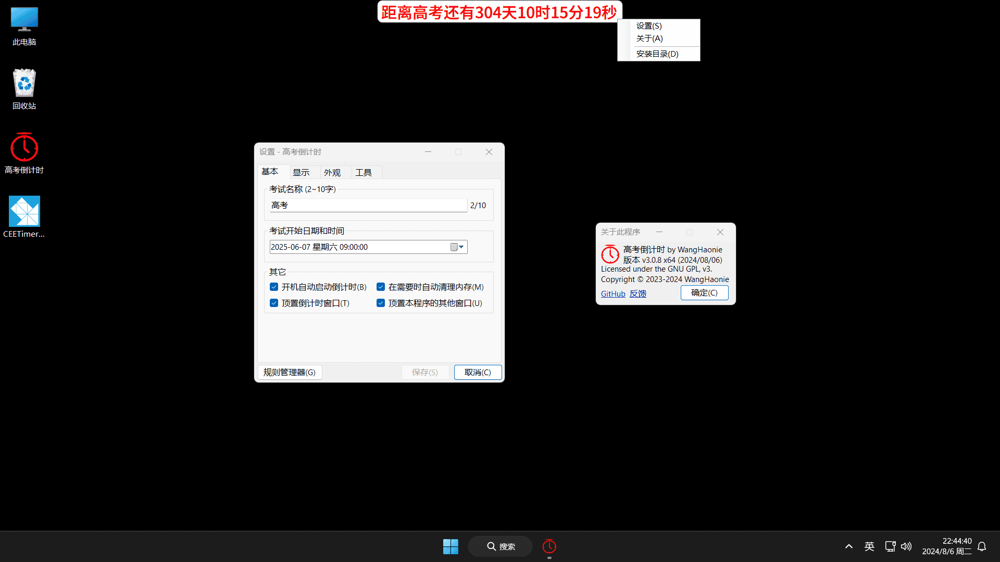

<h4>⚠️注意⚠️本程序完全免费, 且仅通过此 GitHub 仓库进行发布。任何其他网站或个人提供的下载链接均未获得授权, 可能存在安全风险及功能不完整。为了保障您的权益, 请直接从此仓库获取软件及其最新版本。支持正版, 拒绝盗版！<a href="https://github.com/WangHaonie/PlainCEETimer/issues/new/choose" target="_blank">举报盗版</a></h4>

    
    <h2>高考倒计时 by WangHaonie</h2>

   

## 📖 简介
PlainCEETimer, 一个纯粹的高考倒计时, 适用于 Windows 平台, 支持自定义考试名称和时间等。

> [!IMPORTANT]
> 本项目原名 [CEETimerCSharpWinForms](https://github.com/WangHaonie/CEETimerCSharpWinForms/), 当前最新版 v3.0.8 及以前仍使用原名, 新名将在 v3.0.9 及以后被应用。

## 🔥 主要功能
+ ✅ 自定义考试名称；
+ ✅ 自定义考试开始、结束日期和时间；
+ ✅ 自定义显示的位置, 默认左上角 (可设置)；
+ ✅ 设置是否顶置显示, 默认开启 (会被其他后来出现的同样具有顶置属性的窗口遮挡)；
+ ✅ 更改倒计时字体和大小；
+ ✅ 更改倒计时文字、背景颜色；
+ ✅ 支持在不同的时刻显示不同的颜色和内容 (设置>规则管理器, [说明](./.github/Manual.md#规则管理器使用说明))；
+ ✅ 可设置是否只显示天数等 (设置>显示)；
## ✨ 其他功能
+ ✅ 可以拖动, 不过需手动开启；
+ ✅ 防止多开, 同时也防止被关闭 (但可以结束进程)；
+ ✅ 设置开机启动；
+ ✅ 自身内存优化 (需手动开启)；
+ ~~⛔ 跟随虚拟桌面移动 (需手动开启, 不稳定, 估计是系统接口有问题)；~~ (已移除, [说明](./.github/Manual.md#如何显示在所有虚拟桌面上))
+ ✅ 重启倒计时 (用于更改了缩放后重启以防止窗口模糊)；
+ ✅ 检查更新功能, 用户确认后可自动下载并安装；
+ ✅ 同步网络时钟, 确保系统时间准确无误 (因涉及到修改系统设置, 使用此功能可能会弹出 UAC 对话框, 请手动点击允许)；
## 📷 运行截图
> v3.0.8, Windows 11, 1920x1080, 125% 缩放

## 📝 使用说明
### 下载安装
+ 仅适用于 Windows 7 及以上的 x64 系统；
+ 先安装 [.NET Framework 4.7.2](https://dotnet.microsoft.com/zh-cn/download/dotnet-framework/thank-you/net472-offline-installer) (新版 Windows 10/11 可能内置了 .NET Framework 4.8 或更高版本, 可以不用安装)
+ 到 [Releases](https://github.com/WangHaonie/PlainCEETimer/releases/latest) 下载安装程序 PlainCEETimer_X.X_x64_Setup.exe, 按照提示安装就行；
+ 右键倒计时会出现右键菜单 (具体设置项说明请看[这里](./.github/Manual.md#设置界面介绍))。
### 使用方法
+ [点此](./.github/Manual.md)查看详情
## 💻 开发环境
+ Windows 11 Pro x64 (26120.3291)
+ Visual Studio 2022 (17.13.1)
+ .NET Framework (4.7.2)
+ WinForms
+ C# (13.0 Preview)
+ C++ 17 (Toolset v143)
## ⚖️ 开源许可证
Both **PlainCEETimer** and **CEETimerCSharpWinForms** are licensed under the **GNU General Public License v3.0 (GPL-3.0)**.
## 🔗 其他链接
[CSDN 博客](https://blog.csdn.net/WHNdeCSDN/article/details/139425056)
## 💖 打赏作者
[传送门](https://wanghaonie.github.io/reward/reward.jpg)
